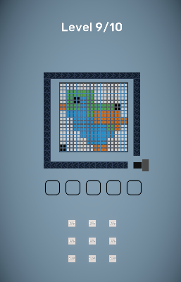

# Rovio Case Project

Unity ile geliştirilen, renk bazlı kutularla ızgaradaki ürünleri toplamaya odaklı bir bulmaca / prototip oyun projesi.

## Ekran görüntüsü

## Proje özeti

- **Konum:** Unity projesi `Rovio_Case` klasöründedir.
- **Ana sahne:** `Assets/Scenes/Game.unity`
- **Oyun akışı:** kutu seç → rota üzerinde hareket → aynı renkteki ürünleri topla → ızgara kaydırma → tüm ürünler bittiğinde bölüm tamamlandı
- **Bölüm ilerlemesi:** `PlayerPrefs` ile tutulur; bölüm bitince sıradaki seviyeye geçilebilir
- **Mimari:** Zenject ile servis bağımlılık enjeksiyonu

## Teknik bilgiler

| Alan | Değer |
| --- | --- |
| Unity Editor | `6000.3.2f1` |
| Render | URP (`com.unity.render-pipelines.universal`) |
| Giriş | Unity Input System (`com.unity.inputsystem`) |
| DI | Zenject |
| Animasyon | DOTween |
| Arayüz | TextMeshPro + uGUI |

## Nasıl çalıştırılır

1. Unity Hub ile `Rovio_Case` klasörünü proje olarak açın.
2. Editor sürümü olarak `6000.3.2f1` (veya uyumlu `6000.3.x`) seçin.
3. `Assets/Scenes/Game.unity` sahnesini açın.
4. **Play** tuşuna basın.

## Oynanış (kısa)

- Kutular **tıklanarak** harekete geçer; kuyrukta yalnızca ön sıradaki kutular seçilebilir.
- Kutu, yol üzerinde ilerlerken yalnızca **kendi rengine** uyan ürünleri toplar.
- Ürün alındıktan sonra ilgili satır veya sütunda **kaydırma** uygulanır.
- Kutu **kapasitesi dolunca** kutu devre dışı kalır.
- Tezgah (**bench**) doluluğu gibi durumlarda **bölüm başarısız** olabilir.
- Izgarada ürün kalmadığında **bölüm tamamlandı** durumu tetiklenir.

## Klasör yapısı (özet)

| Yol | İçerik |
| --- | --- |
| `Rovio_Case/Assets/Scripts/Game` | Oyun ve bölüm akışı, durum yönetimi |
| `Rovio_Case/Assets/Scripts/Boxes` | Kutu üretimi, kuyruk, hareket, toplama, tezgah (bench) |
| `Rovio_Case/Assets/Scripts/Services` | Izgarada veri ve kaydırma mantığı |
| `Rovio_Case/Assets/Scripts/Products` | Ürün etkileşimi ve görsel akış |
| `Rovio_Case/Assets/Scripts/UI` | HUD ve bitiş ekranı |
| `Rovio_Case/Assets/Scripts/Installers` | Zenject bağlamaları |
| `Rovio_Case/Assets/Scripts/Editor` | Bölüm araçları ve hızlı test pencereleri |

## Editör araçları

- **Tools → Level → Pixel Level Editor:** Doku üzerinden `LevelLayout` ürün hücreleri ve palet oluşturma (doku için Read/Write önerilir).
- **Tools → Level → Level Quick Start:** `LevelSequenceConfig` ile bölüm indeksi seçip hızlı oynatma / test.

## Geliştirme notları

- Derleme listesindeki oyun sahnesi: `Assets/Scenes/Game.unity`
- Bölüm sırası: `LevelSequenceConfig` ScriptableObject
- Aktif bölüm indeksi anahtarı: `LevelPrefsKeys.CurrentLevelIndex`

## Lisans ve üçüncü taraflar

Projede Zenject, DOTween, Feel ve benzeri üçüncü taraf paket / varlıklar kullanılmıştır. Lisans metinleri ilgili paket klasörlerindeki dosyalarda yer alır.
